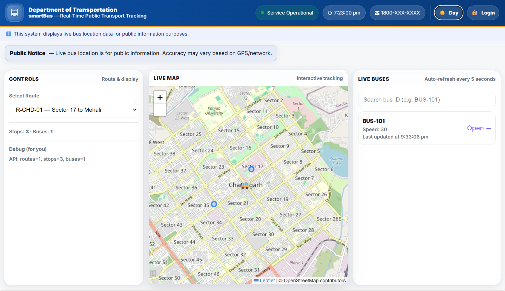
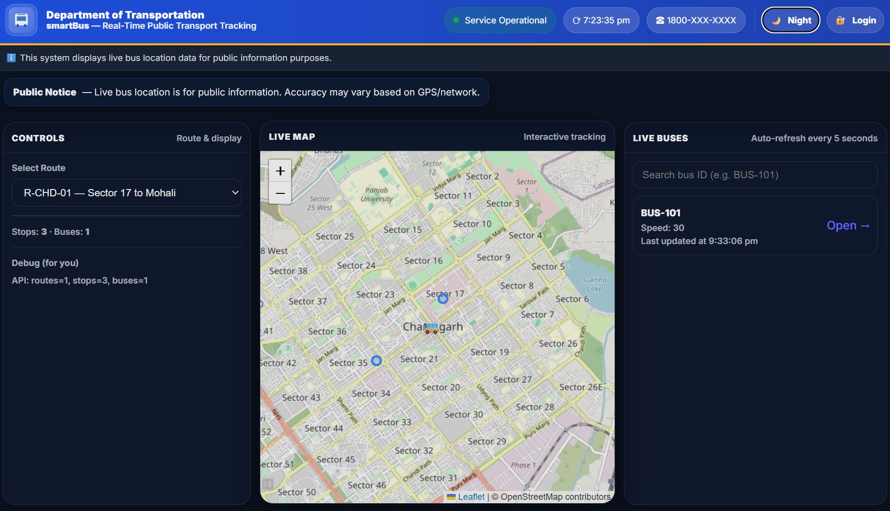
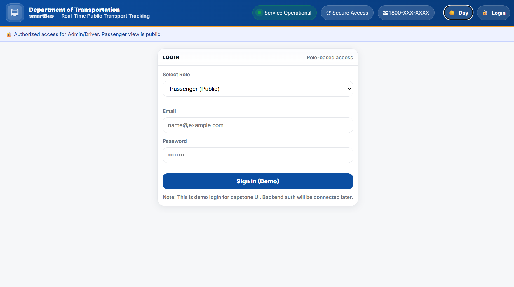
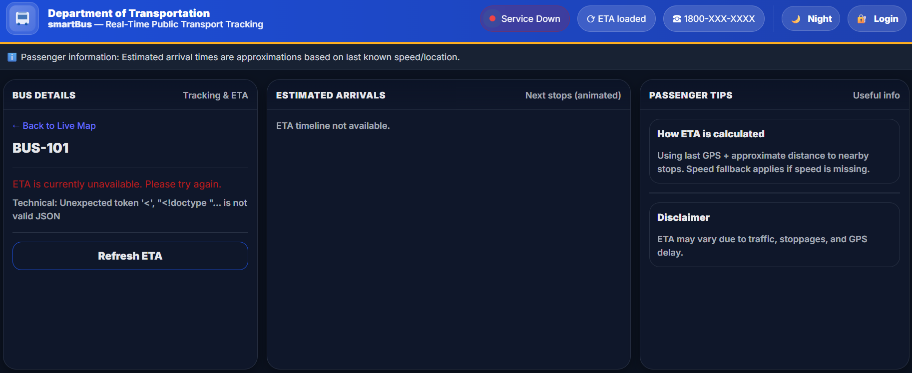

## SmartBus — Real-Time Public Transport Tracking Platform

smartBus is a modern, responsive, real-time public transport tracking platform designed to visualize live bus locations, routes, stops, and estimated arrival times (ETA).
Built with a government-grade UI, role-based access, and scalable architecture, it simulates how real-world intelligent transport systems operate today.

## Live Features Overview

 Passenger (Public) View

Live bus tracking on interactive maps (Leaflet + OpenStreetMap)

Route-based filtering of buses and stops

Real-time bus list with auto-refresh

Animated bus markers with smooth motion

ETA timeline (when backend available)

Public notices & service alerts

Fully responsive (desktop, tablet, mobile)

## Role-Based Access (UI-ready)

Passenger (Public)

Driver (Planned)

Admin (Planned)

Secure login UI (backend integration planned)

## UI & UX Highlights

Government-style premium interface

Light / Dark mode toggle

Skeleton loaders for smooth loading UX

Animated transitions (Framer Motion)

Accessible typography (Inter / system fonts)

Mobile-first responsive design

## UI / UX Design

The UI/UX design for the **smartBus** platform was created using **Figma**.  
The design focuses on a clean and intuitive layout with a clear visual hierarchy, easy navigation, and responsive behavior to ensure a smooth user experience across devices.

It includes well-structured screens, consistent UI components, and clearly defined user flows. This design serves as a visual reference for development and supports future enhancements of the platform.

## 🔗 Figma Design Link:
https://www.figma.com/design/HBes82ZYORR1es0prPHoLd/punbus-website-design?node-id=0-1&t=Xs8OiWMqBlkxNjxR-1

<h2>📸 Screenshots</h2>

  
  

  
  

## Tech Stack

## Frontend

React + Vite

React Router

Leaflet.js (Maps)

Framer Motion (Animations)

Modern CSS (Grid, Flexbox, Variables)

Responsive & Mobile-First Design

## Backend (In Progress / Partial)

Node.js

Express

MongoDB

JWT Authentication

Role-based Authorization

## Architecture Overview

Frontend (React)
 
 ├── Live Map Dashboard
 
 ├── Bus Details + ETA
 
 ├── Login (Role-based)
 
 ├── Alerts & Notices
 
 └── Dark Mode / UX Enhancements

## Backend (Node + Express)

 ├── Live Bus GPS API
 
 ├── Routes & Stops API
 
 ├── ETA Calculation Engine
 
 └── Auth & Roles (Planned)

## Local Setup

1️⃣ Clone the Repository

git clone https://github.com/your-username/smartBus.git

cd smartBus

2️⃣ Install Dependencies

npm install

3️⃣ Start Frontend

npm run dev

Frontend will run at:

http://localhost:5173

## Current Status

Feature	Status

Live Map	✅ Implemented

Animated Bus Markers	✅ Implemented

Skeleton Loaders	✅ Implemented

ETA UI	⚠️ Backend pending

Login UI	✅ Implemented

Role-based Auth	⏳ Planned

Admin Dashboard	⏳ Planned

## Future Enhancements

Real ETA engine with traffic-aware calculations

Admin dashboard for route & bus management

Driver mobile interface for GPS updates

Push notifications for delays & alerts

Analytics dashboard (ridership, punctuality)

Progressive Web App (PWA) support

## ⚠️ Disclaimer

This platform is developed as an academic / capstone project.

Live bus data and ETA calculations are simulated and meant for demonstration purposes only.

## 👨‍💻 Author

Nishad

🎓 Computer Science and Engineering

📍 India

🔗 GitHub: https://github.com/NishadSharma

Support

If you like this project:

⭐ Star the repository

🍴 Fork it

🧠 Suggest improvements via issues

